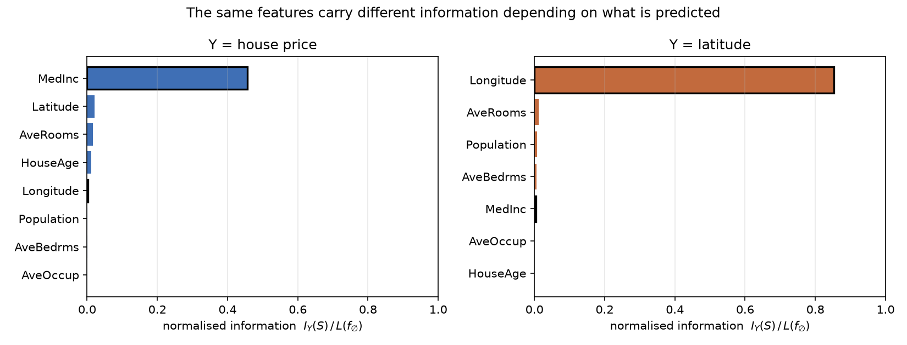
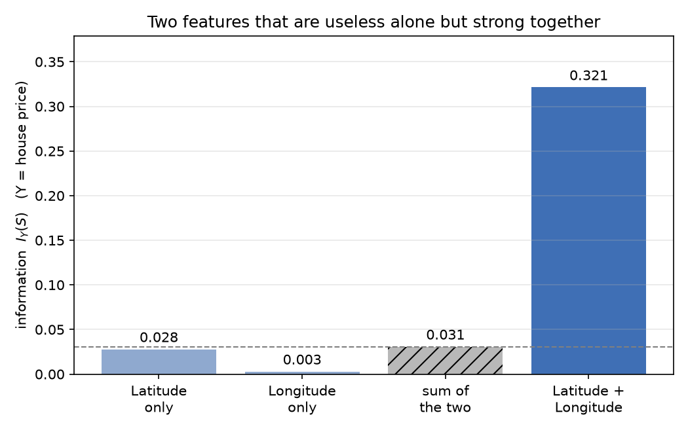

# 情報とは、ある対象を予測するのに有効なものである

**氏名:** 濱本惇之介

## 1. 概要

本課題では「情報とは何か」という問いに対して、次のように定義する。

> **情報とは、ある対象を予測するのに有効なものである。**

この定義では、あるデータが情報として機能するかどうかは「何を予測したいか」によって決まる。つまり、情報はデータ単独の絶対的な性質ではなく、予測対象との関係で決まる相対的なものです。
本課題では、カリフォルニア州の住宅データと線形回帰を用いて、以下の2点からこの主張を数値的に検証します。
 
 1. 予測対象を変えると、情報量の順位は入れ替わる
 2. 単独では無力な特徴も、組み合わせることで有効な情報になる


## 2. 情報の定義

### 2.1 記法

| 記号 | 意味 |
| --- | --- |
| $Y$ | 予測対象 |
| $S$ | 使用する特徴の集合 |
| $\hat f_S$ | $S$ を入力として学習した予測器（本課題では線形回帰） |
| $\hat f_\varnothing$ | 特徴を一切使わない予測器（訓練データの平均値を常に出力する） |
| $L(\cdot)$ | テストデータ上の予測損失（平均二乗誤差） |

### 2.2 定義

特徴集合 $S$ が予測対象 $Y$ に対して持つ情報量を、次で定義する。

$$
\mathcal{I}_Y(S) = L(\hat f_\varnothing) - L(\hat f_S)
$$

すなわち「その特徴を使うことで、予測誤差がどれだけ減ったか」である。$\mathcal{I}_Y(S) > 0$ のとき、$S$ は $Y$ の予測に有効であり、$Y$ についての情報を持つという。

この定義に当てはめると、特徴を使わない場合、予測の誤差は減らないため、得られる情報量はゼロになり、これを数式で表すと次のようになる。

$$
\mathcal{I}_Y(\varnothing) = 0
$$

定義式が示すように、情報量 $\mathcal{I}_Y(S)$ は予測対象 $Y$ によって定まる量である。したがって、入力となる特徴集合 $S$ が同一であっても、予測対象が $Y_1, Y_2$ と異なれば、得られる情報量は一般に異なる値をとる。すなわち、次が成り立つ。

$$
\mathcal{I}_{Y_1}(S) \neq \mathcal{I}_{Y_2}(S)
$$

実験1では、この予測対象の違いに伴う情報量の変化を数値的に検証する。
さらに、情報量が個々の特徴に独立して分配可能（加法的）であると仮定すれば、$\mathcal{I}_Y(A \cup B) = \mathcal{I}_Y(A) + \mathcal{I}_Y(B)$ が成り立つ。しかし、実際には複数の特徴が組み合わさることで初めて立ち現れる情報が存在するため、組み合わせた際の情報量が単独の情報量の和を大きく上回る場合がある。すなわち、次のような非加法的な関係が成立しうる。

$$
\mathcal{I}_Y(A \cup B) \gg \mathcal{I}_Y(A) + \mathcal{I}_Y(B)
$$

実験2では、この特徴の組み合わせによる情報量の増大（超加法性）を検証する。

### 2.3 正規化

$\mathcal{I}_Y(S)$ は $Y$ の二乗の次元を持つため、単位の異なる予測対象どうし（価格はドル、緯度は度）では絶対値を直接比較できない。そこで対象をまたいで比較する場合は、ベースライン損失で割った無次元量

$$
\tilde{\mathcal{I}}_Y(S) = \frac{\mathcal{I}_Y(S)}{L(\hat f_\varnothing)}
$$

を用いる。これは「ベースラインの誤差のうち何割を取り除けたか」を表す。実験1ではこの正規化した量を、実験2では対象が固定されているので $\mathcal{I}_Y(S)$ をそのまま用いる。

### 2.4 講義で扱った交差エントロピーとの関係

第2回の講義では、交差エントロピーの議論を通して「予測の損失の減少分として情報を捉える」という考え方が示された。本課題の $\mathcal{I}_Y(S)$ は、この枠組みを回帰問題の二乗誤差に置き換えて適用したものである。講義内の議論では予測対象が常に固定されていたが、本課題ではあえて 予測対象 $Y$ を動かす ことを試みる。目的変数 $Y$ を取り替えることで、同じ特徴量であっても予測対象との関係によって情報量がどう組み替わるかを検証する。なお、損失関数を交差エントロピーから二乗誤差に変えても定義の構造が成り立つことは、情報が「何を基準として誤差を測るか」というルールの選び方にも依存することを示している。

---

## 3. 実験の設定

### 3.1 データ

scikit-learn に含まれる **California Housing** データセット（20,640 地区、8 特徴）を用いる。各行はカリフォルニア州の一地区を表す。

| 特徴 | 意味 |
| --- | --- |
| MedInc | 世帯収入の中央値 |
| HouseAge | 築年数の中央値 |
| AveRooms | 一世帯あたり平均部屋数 |
| AveBedrms | 一世帯あたり平均寝室数 |
| Population | 人口 |
| AveOccup | 一世帯あたり平均居住人数 |
| Latitude | 緯度 |
| Longitude | 経度 |

標準の予測対象は住宅価格の中央値（10万ドル単位）である。

### 3.2 手順

1. データを訓練 70% / テスト 30% に分割する（`random_state=0` で固定）。
2. 特徴を使わない予測器として、訓練データの平均値を常に出力するものを用い、そのテスト損失 $L(\hat f_\varnothing)$ を求める。
3. 特徴集合 $S$ で線形回帰を訓練し、テスト損失 $L(\hat f_S)$ を求める。
4. 差を取って $\mathcal{I}_Y(S)$ とする。

---

## 4. 実行方法

### 4.1 環境構築
以下のコマンドを実行してリポジトリをダウンロードし、Condaで必要なパッケージが揃った専用の仮想環境（info-pred）を構築して有効化します。

```bash
git clone https://github.com/Hamamoto-Junnosuke/Applied-Math-Computation-B.git
cd Applied-Math-Computation-B/Final_Assignment
conda env create -f environment.yml
conda activate info-pred
```

### 4.2 実行
続いて src ディレクトリに移動し、実験1（予測対象の変更）と実験2（特徴の組み合わせ）の検証スクリプトをそれぞれ実行します。

```bash
cd src
python experiment1_target.py
python experiment2_combine.py
```

実行すると数値が標準出力に表示され、図が `figures/` に保存される。

- `figures/fig1_two_targets.png`
- `figures/fig2_combination.png`

初回実行時、scikit-learn が California Housing データを自動でダウンロードするため、インターネット接続が必要である。

---

## 5. 結果

### 5.1 実験1：予測対象を変えると情報量の順位が入れ替わる

同じ8つの特徴について、予測対象を「住宅価格」と「緯度」の二通りに変えて、各特徴が単独で持つ情報量を測った。緯度を予測する場合、緯度自身は特徴から除いてある。



| 特徴 | $\tilde{\mathcal{I}}$（Y = 価格） | $\tilde{\mathcal{I}}$（Y = 緯度） |
| --- | --- | --- |
| MedInc | **0.4565（1位）** | 0.0042（5位） |
| Latitude | 0.0209（2位） | — |
| AveRooms | 0.0164（3位） | 0.0116（2位） |
| HouseAge | 0.0120（4位） | −0.0009（7位） |
| Longitude | 0.0022（5位） | **0.8528（1位）** |
| Population | 0.0004（6位） | 0.0069（3位） |
| AveBedrms | 0.0003（7位） | 0.0053（4位） |
| AveOccup | −0.0021（8位） | −0.0002（6位） |

世帯収入（MedInc）は、価格の予測に対してはベースライン誤差を約46%削減し、最も有効な特徴量となっている。しかし、緯度の予測に対しては0.4%しか寄与せず、5位に低下する。対照的に、経度（Longitude）は価格の予測に対しては0.2%の寄与にとどまるが、緯度の予測に対しては誤差の約85%を削減し1位となる（※カリフォルニア州が北西から南東に斜めに位置しており、緯度と経度に強い地理的相関があるため）。この結果は、使用するデータや計算手法が全く同じであっても、予測対象 $Y$ が変われば特徴量の有用性（情報量の大きさ）が根本的に変化することを示している。

また、AveOccup（両対象）や HouseAge（緯度対象）のように、情報量がわずかに負の値を示すケースが存在する。これは、その特徴量が予測に寄与しないだけでなく、有限の訓練データに対する過学習（過剰適合）が生じ、テスト誤差がベースラインよりもかえって悪化したことを意味する。理論上の上限を測るシャノンの相互情報量が常に非負であるのに対し、本課題の $\mathcal{I}_Y(S)$ は「特定の予測モデルと有限のデータを用いて、実際に抽出できた情報」を測る量である。そのため、このように予測に悪影響を及ぼした場合には負の値を取りうるという性質を持つ。

### 5.2 実験2：単独では無情報でも、組み合わせると情報になる

予測対象を住宅価格に固定し、特徴集合の方を変えた。



| 特徴集合 $S$ | $\mathcal{I}_Y(S)$ |
| --- | --- |
| {緯度} | 0.0279 |
| {経度} | 0.0029 |
| （単独の値の和） | 0.0308 |
| {緯度, 経度} | **0.3214** |

緯度だけ、経度だけではほとんど価格を説明できないのに、両方を同時に使うと情報量は単独の和の約 **10.4倍** になる。すなわち

$$
\mathcal{I}_Y(\{\text{lat}, \text{lon}\}) \;\gg\; \mathcal{I}_Y(\{\text{lat}\}) + \mathcal{I}_Y(\{\text{lon}\})
$$

である。理由は次のように理解できる。カリフォルニアでは海岸線が斜めに走っており、価格を決めるのは「海岸からの距離」にあたる方向である。この方向は緯度と経度の組み合わせでしか表現できない。緯度だけを見ても、同じ緯度に高価な沿岸部と安価な内陸部が混在しているため区別がつかない。経度だけでも同様である。二つを同時に与えて初めて、価格に効く方向が表現可能になる。

---

## 6. 議論

### 6.1 情報は予測対象とセットでしか決まらない

実験1の結果から、「特定のデータ（例えば経度）が情報を持っているか」という問い自体があまり意味を持たないことがわかる。なぜなら、データが予測の役に立つかどうかは「何を予測したいか」に完全に依存しているからだ。実際、経度は緯度を予測する際にはとても強力な情報になるが、価格の予測においてはほとんど無情報になってしまう。

講義第1回では、情報を「不確実性を減少させるもの」と定義した。この考え方には、「何についての不確実性か」を指定して初めて情報量が決まるという前提がある。講義第3回のRemark 1.1で「シャノン情報は、観測者が確率空間を選び、何を関連する変数とみなすかを決めて初めて定義される」と指摘されていたのと同じことだ。本課題は、この観測者の選択を「予測対象 $Y$」として設定し、$Y$ を変えることで情報量がどう組み替わるかを数値で確かめたものと言える。  

この見方は、講義第4回で学んだシステム論ともつながっている。第4回では、システムの境界 $b_{\mathcal{O}}$ は観測者が決めるものだと説明された。「何を情報とみなすか」も同じで、データの中に絶対的な価値が最初からあるわけではなく、私たちがどういう目的を設定するかによって決まるものだと考えられる。


### 6.2 情報は特徴ごとに分配できない

実験2の結果は、情報量が単純な足し算にはならないことを示している。緯度と経度の情報量を別々に計算して足しても0.0308にしかならないのに、両方を同時に使うと0.3214という大きな情報量が得られた。この増えた分（0.2906）は、緯度や経度どちらか単独のものではなく、二つの特徴の「関係性」そのものから生まれていると言える。

この仕組みは、講義第3回で学んだ「統合情報（Integrated Information）」の考え方と非常によく似ている。第3回の例1.3では、二つのユニット $A, B$ を切り離して独立に扱うと要素間の関係性が失われ、その失われた情報（$\phi = 1$ ビット）が統合情報として定義されていた。  

今回の課題で、緯度と経度を「別々の特徴として個別に評価する」という操作は、まさにこの「系を切る（分断する）」操作にあたる。要素を切り離すと関係性の情報が消えてしまうという点で、両者で起きている現象は本質的に同じだと言える。

機械学習の実務で特徴量エンジニアリングがよく使われる理由も、この観点から説明できるのではないだろうか。データを加工したり組み合わせたりしても、元のデータそのものが持っている情報量が増えるわけではない。しかし、そのままでは予測モデルが読み取れなかった「特徴どうしの関係性」を、モデルが使える形に引き出してあげることができる。本課題のように「予測に有効なもの」を情報と呼ぶのであれば、このように関係性を使える状態にする操作は、結果として情報量を増やしているのと同じだと言える。

### 6.3 限界

本課題の定義と実験には次の限界がある。

1. **予測器を線形回帰に固定している。** 情報量は予測器の表現能力に依存するため、非線形モデルを使えば値は変わる。特に実験2の緯度と経度は、決定木のように軸ごとに分割できるモデルを使うと単独でもある程度は効くと予想され、超加法性は弱まる可能性がある。「情報は予測器にも相対的である」という第三の主張に発展させられるが、本課題では扱わなかった。
2. **損失関数を二乗誤差に固定している。** 2.4 で述べたとおり、何を「当たり」とみなすかによって情報量は変わる。
3. **有限データによる推定である。** 情報量は有限のテストデータ上で測った値であり、真の値の推定値にすぎない。実験1で AveOccup と HouseAge がわずかに負になったのは、この影響である。
4. **既存の概念との関係。** 本課題の $\mathcal{I}_Y(S)$ は、機械学習で用いられる ablation による特徴重要度と実質的に同じ計算である。本課題の主張は新しい量を提案したことではなく、この量を「情報とは何か」の定義として据え、$Y$ を動かすことで情報の相対性を示した点にある。

---

## 7. ファイル構成

```
Final_Assignment/
├── README.md
├── environment.yml
├── src/
│   ├── info.py                  情報量 I_Y(S) の定義
│   ├── experiment1_target.py    実験1：予測対象を変える
│   └── experiment2_combine.py   実験2：特徴を組み合わせる
└── figures/
    ├── fig1_two_targets.png
    └── fig2_combination.png
```
