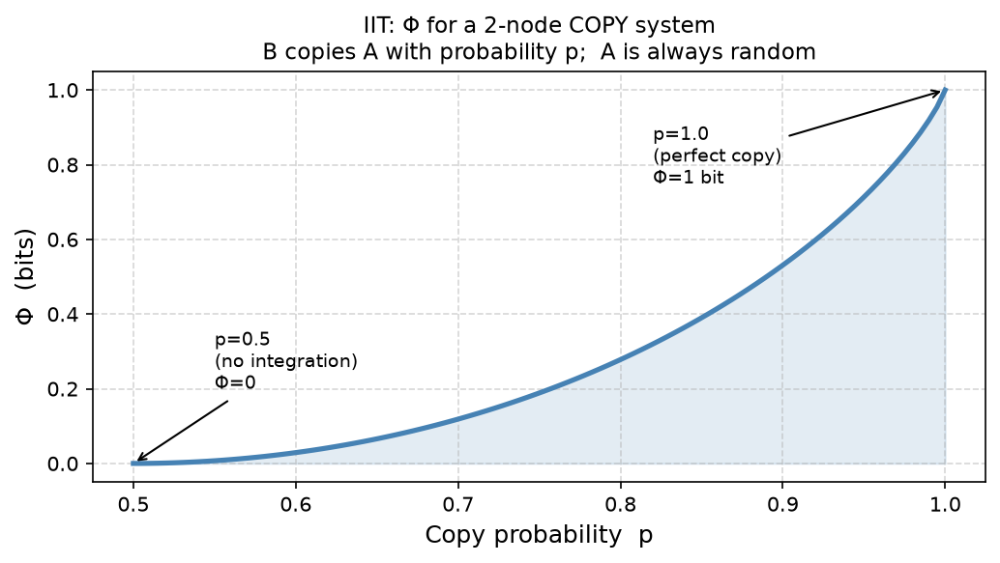

# Lecture 3 Report – IIT Example: 2-node COPY System



## Overview

This report illustrates an example of **Integrated Information Theory (IIT)**
that was **not shown in the lecture note**.

We examine how **Φ (Phi)** changes in a minimal 2-node binary system
where one node copies another with varying probability.

---

## System Description

| Node | Behavior |
|------|----------|
| **A** | Always updates randomly (0 or 1 with equal probability) |
| **B** | Copies the *current* value of A with probability **p** |

- **p = 0.5** → B is effectively random, independent of A → **Φ = 0**
- **p = 1.0** → B perfectly copies A → **Φ = 1 bit**

---

## Key Idea

Φ measures how much information is generated by the system **as a whole**
beyond what its parts generate independently.

$$\Phi = I(S_t \to S_{t+1}) - \min_{\text{partition}} \sum_k I(S_t^k \to S_{t+1}^k)$$

When B has no causal link to A (p = 0.5), cutting the system in half
loses nothing — the parts explain everything. So **Φ = 0**.
When B perfectly copies A (p = 1), the whole system carries information
that neither part carries alone. So **Φ > 0**.

---

## Result

Φ rises smoothly from 0 to 1 bit as the copy probability increases from 0.5 to 1.0,
showing that **causal integration** is what drives integrated information.

---

## How to Run

```bash
python iit_plot.py
```

**Requirements:** Python 3.8+, `numpy`, `matplotlib`

---

## References

- Tononi, G. (2004). *An information integration theory of consciousness.* BMC Neuroscience, 5, 42.
- Oizumi, M., Albantakis, L., & Tononi, G. (2014). *From the Phenomenology to the Mechanisms of Consciousness: Integrated Information Theory 3.0.* PLOS Computational Biology.
